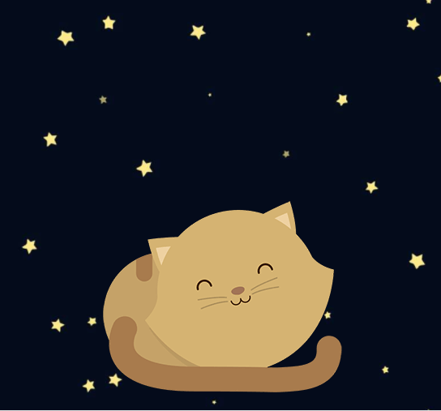

## README
### Proyecto: Kitten

1. Descripción del Proyecto
	-Este proyecto contiene una página web responsive usando tres tamaños de dispositivo

2. Herramientas utilizadas
	- HTML5
	- CSS3

3. Autor
	- Lilliam Haro

